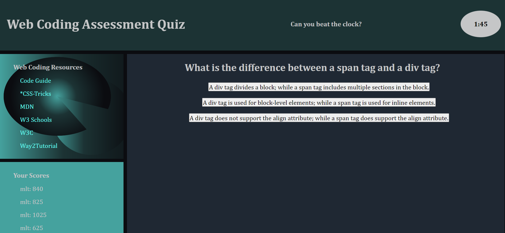

# coding-quiz

## Description

A user clicks through an interactive coding quiz, then enters initials to save the high score before resetting and starting over. 

## User Story

The user is trying to answer the coding quiz questions correctly while beating the clock and their own previous score.  They faster the user answers the questions, the highter the user's score.

## Acceptance Criteria

When User clicks the "Start Quiz" button
Then the first question will appear and the timer will start counting down.
When the user clicks on the correct answer
Then the page will say "Correct!", the clock will pause.
When the user clicks "ok"
Then 5 seconds will be added to the clock and the next question will appear.
When the user clicks the incorrect answer
Then the page will say "Try again!", the clock will pause
When the user clicks "ok"
Then 20 seconds will be subtracted from the clock and user can choose another answer until they choose the correct answer or the clock runs out
When the user runs out of time
Then "Game Over. Try again!" and the user get no score
When the user completes the quiz successfully
Then "Congratulations! You've won!" appears 
When the user clicks "ok"
Then user is asked to "Type your initials here!"
When user enters their initials and clicks ok
Then users initials and score, which is calculated by multiplying the time on the clock by 5, appears on the "Your Scores" board

## Assets

The following image demonstrates the web application's appearance and functionality:

## Repository & Live Link

[Here is the repository link.] https://github.com/MicheleTornetta/coding-quiz

[Here is the live link.] https://MicheleTornetta.github.io/coding-quiz/

